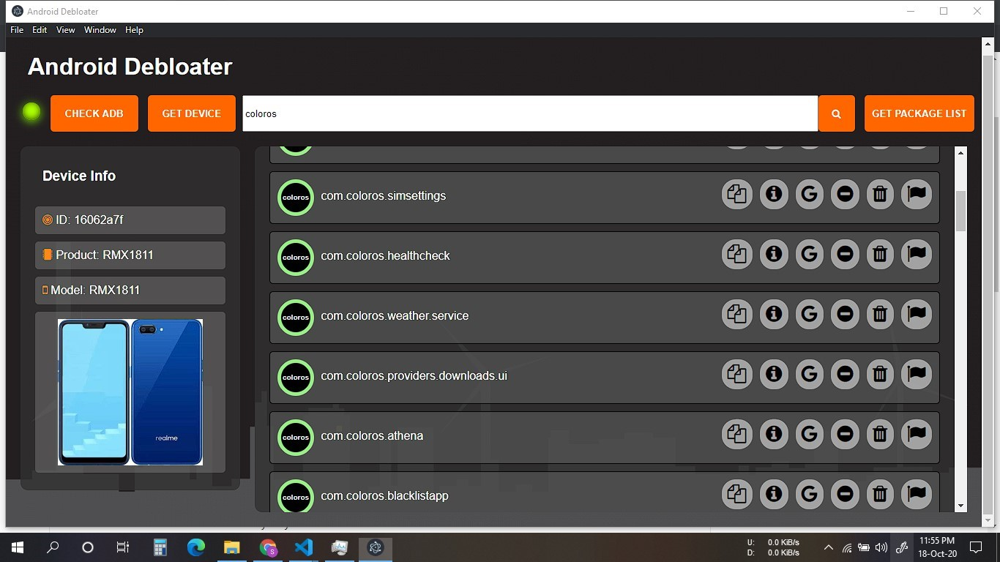

# Debloat Your Android
Debloat Your Android Phone the easy way

## Pre Release available:
https://github.com/sprtkd/debloat_android/releases/tag/v0.0.1

# <a href="https://github.com/sprtkd/debloat_android/releases/download/v0.0.1/debloat_android_winx64.zip" download>Download 0.0.1</a>


**Use at Your Own Risk**
This app can potentially brick your device in its current state

## Run
This requires ADB inside platform-tools folder
You need to run:
```
python.app.py
```

In a new shell, go to angular-electron and run:
```
npm start
```

Using direct adb calls to automate the listing, logging and removal/disabling of bloatware

## Whitelist for common vendors to be added soon

## Screenshot




